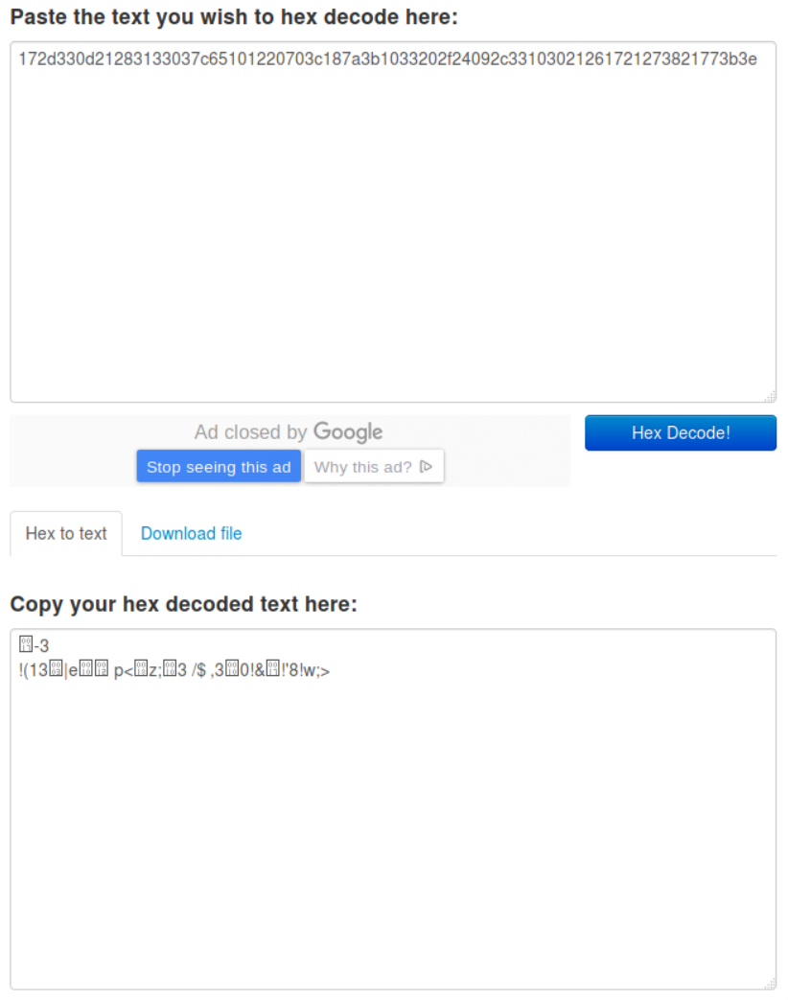

# Welcome challenge writeup

**Category:** Crypto - 100 points

**Description:**

> 172d330d21283133037c65101220703c187a3b1033202f24092c33103021261721273821773b3e


## Solution write-up

Contrary to most CTFs, the welcome challenge wasn't a "free" one. Ableit not a very hard one.
The first thing I thought about was a simple hex encoding so I looked for an online decoder because I'm lazy.



Welp, doesn't seem like what we're loking for. 


Since most bytes are in the ASCII range, as shown by the hex decoding, I thought they might have been simply shifted. Like a Ceasar cipher.
Since I know that the flag will begin with "AceBear{", I tried to see what the shift could be. I also wanted to verify if the shift was the same for all the characters.

```python
chall = "172d330d21283133037c65101220703c187a3b1033202f24092c33103021261721273821773b3e".decode("hex")
clear = "AceBear{"
  
print [(ord(i) - ord(j)) for i,j in zip(chall[:len(clear)], clear)]
```

```
$ python welcome.py 
[-42, -54, -50, -53, -68, -57, -65, -72]
```

Okay so this is definitly not as easy as I thought. However, I think this track won't lead anywhere, as the shift values don't seem to have any logic, at least at first glance.

Since this isn't encrypted with a shift cipher, the only simple cipher I can think of would be a XOR. Let's try that.

```python
key = "".join( chr(ord(a)^ord(b)) for a,b in zip(chall[:len(clear)], "clear") )

print key

print "".join( chr(ord(a)^ord(b)) for a,b in zip(chall, itertools.cycle(key)) )
```

```
$ python welcome.py 
VNVODICH
AceBear{U23_Vi3tN4m_will_be_the_winn3r}
```

And we finally get the flag : `AceBear{U23_Vi3tN4m_will_be_the_winn3r}`
